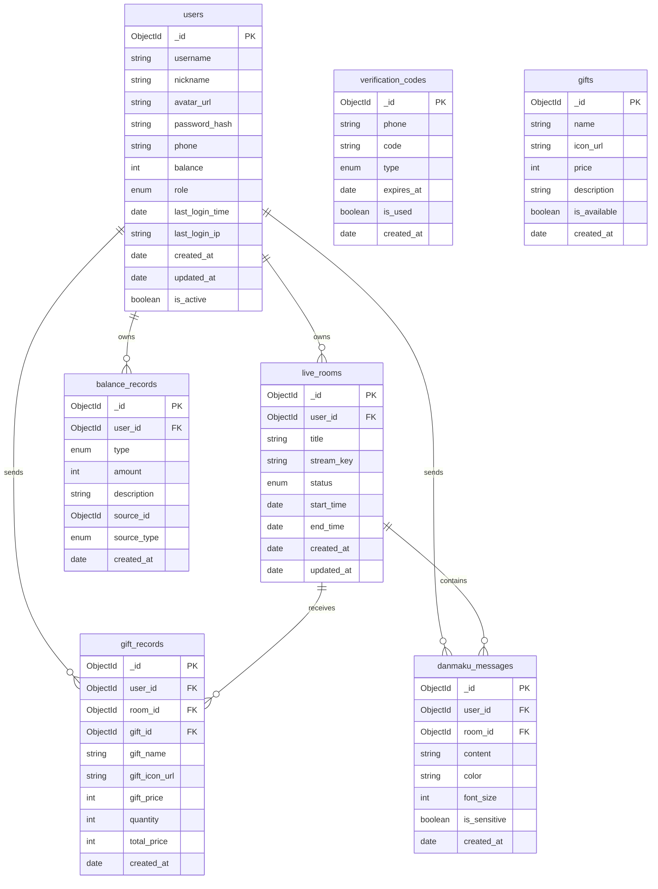

# 直播平台数据库设计 (MongoDB版本)

## 集合设计



## 集合结构说明

### users (用户集合)
```javascript
{
  _id: ObjectId,
  username: String,          // 用户名
  nickname: String,          // 昵称
  avatar_url: String,        // 头像URL
  password_hash: String,     // 密码哈希
  phone: String,            // 手机号
  balance: Number,          // 账户余额(分)
  role: {                   // 用户角色
    type: String,
    enum: ['user', 'streamer', 'admin']
  },
  last_login_time: Date,    // 最后登录时间
  last_login_ip: String,    // 最后登录IP
  created_at: Date,         // 创建时间
  updated_at: Date,         // 更新时间
  is_active: Boolean        // 是否激活
}
```

### verification_codes (验证码集合)
```javascript
{
  _id: ObjectId,
  phone: String,           // 手机号
  code: String,            // 验证码
  type: {                  // 验证码类型
    type: String,
    enum: ['register', 'login', 'reset_password']
  },
  expires_at: Date,        // 过期时间
  is_used: Boolean,        // 是否已使用
  created_at: Date         // 创建时间
}
```

### live_rooms (直播间集合)
```javascript
{
  _id: ObjectId,
  user_id: ObjectId,       // 主播用户ID
  title: String,           // 直播间标题
  stream_key: String,      // 推流密钥
  status: {                // 直播状态
    type: String,
    enum: ['pending', 'live', 'finished']
  },
  start_time: Date,        // 开播时间
  end_time: Date,          // 结束时间
  created_at: Date,        // 创建时间
  updated_at: Date         // 更新时间
}
```

### gifts (礼物集合)
```javascript
{
  _id: ObjectId,
  name: String,            // 礼物名称
  icon_url: String,        // 礼物图标URL
  price: Number,           // 价格(分)
  description: String,     // 礼物描述
  is_available: Boolean,   // 是否可用
  created_at: Date         // 创建时间
}
```

### gift_records (礼物记录集合)
```javascript
{
  _id: ObjectId,
  user_id: ObjectId,       // 赠送用户ID
  room_id: ObjectId,       // 直播间ID
  gift_id: ObjectId,       // 礼物ID
  gift_name: String,       // 礼物名称(冗余)
  gift_icon_url: String,   // 礼物图标URL(冗余)
  gift_price: Number,      // 礼物单价(冗余)
  quantity: Number,        // 数量
  total_price: Number,     // 总价(分)
  created_at: Date         // 创建时间
}
```

### balance_records (余额变动记录集合)
```javascript
{
  _id: ObjectId,
  user_id: ObjectId,       // 用户ID
  type: {                  // 变动类型
    type: String,
    enum: ['recharge', 'gift_send', 'gift_receive']
  },
  amount: Number,          // 变动金额(分)
  description: String,     // 变动说明
  source_id: ObjectId,     // 关联ID(充值订单ID或礼物记录ID)
  source_type: {           // 来源类型
    type: String,
    enum: ['recharge_order', 'gift_record']
  },
  created_at: Date         // 创建时间
}
```

### danmaku_messages (弹幕消息集合)
```javascript
{
  _id: ObjectId,
  user_id: ObjectId,       // 发送用户ID
  room_id: ObjectId,       // 直播间ID
  content: String,         // 弹幕内容
  color: String,           // 弹幕颜色
  font_size: Number,       // 字体大小
  is_sensitive: Boolean,   // 是否敏感词
  created_at: Date         // 创建时间
}
```

## 设计优化说明

1. MongoDB特性优化
   - 使用ObjectId作为主键，自带时间戳信息
   - 利用MongoDB的schema-less特性，方便后续扩展字段
   - 适当冗余数据以减少关联查询

2. 索引设计
   ```javascript
   // users集合
   db.users.createIndex({ "phone": 1 }, { unique: true })
   db.users.createIndex({ "username": 1 }, { unique: true })
   
   // verification_codes集合
   db.verification_codes.createIndex({ "phone": 1, "type": 1 })
   db.verification_codes.createIndex({ "expires_at": 1 }, { expireAfterSeconds: 0 })
   
   // live_rooms集合
   db.live_rooms.createIndex({ "user_id": 1 })
   db.live_rooms.createIndex({ "status": 1 })
   
   // gift_records集合
   db.gift_records.createIndex({ "room_id": 1, "created_at": -1 })
   db.gift_records.createIndex({ "user_id": 1, "created_at": -1 })
   
   // balance_records集合
   db.balance_records.createIndex({ "user_id": 1, "created_at": -1 })
   
   // danmaku_messages集合
   db.danmaku_messages.createIndex({ "room_id": 1, "created_at": 1 })
   ```

3. 数据冗余优化
   - gift_records集合冗余存储礼物信息，避免频繁关联查询
   - 使用枚举类型规范状态字段

4. 安全性考虑
   - 密码使用哈希存储
   - 验证码设置过期时间
   - 记录用户登录IP和时间
   - 余额变动有详细日志和来源追踪

5. 性能优化
   - 合理设计索引提升查询效率
   - 适当冗余减少关联查询
   - 使用TTL索引自动清理过期验证码
